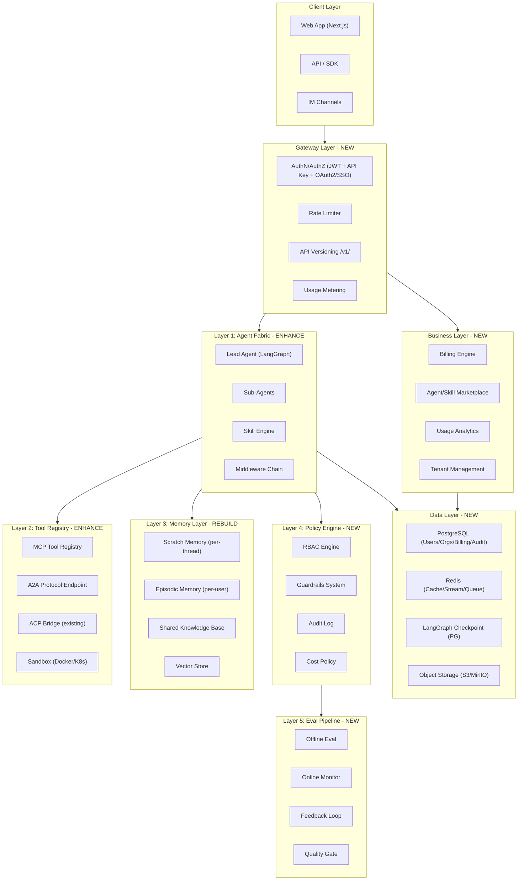

# DeerFlow 商业化转型全盘分析与改造计划

## 一、项目现状总结

当前项目是 **DeerFlow 2.0** -- 一个基于 LangGraph/LangChain 的开源 super agent harness，核心能力包括:

- Lead Agent + Middleware 链式架构（摘要、TODO、记忆、视觉、澄清、循环检测等）
- MCP 工具集成（stdio/SSE/HTTP + OAuth）
- Skills 系统（Markdown 工作流 + 自定义技能编辑器）
- Sub-agents 和 ACP 外部 agent 调用
- 多 IM 频道（Telegram/Slack/飞书/微信/企微）
- 文件系统沙箱（Docker/K8s）
- SSE 流式输出 + Next.js 16 前端

**技术栈**: Python 3.12 (FastAPI + uv) / TypeScript (Next.js 16 + pnpm) / LangGraph / nginx

---

## 二、商业化关键差距分析

对照 2026 年企业级 Agent 平台参考架构（五层模型：Agent Fabric / Tool Registry / Memory Layer / Policy Engine / Eval Pipeline），当前项目存在以下 **10 大核心差距**：

### 差距 1: 认证与授权体系缺失 (Critical)

- **现状**: 前端仅有 `better-auth` 的 email/password 登录（[frontend/src/server/better-auth/config.ts](frontend/src/server/better-auth/config.ts)），**后端 Gateway 无任何认证中间件**，所有 API 路由裸露
- **影响**: 无法区分用户，无法计费，无法做权限控制
- **改造**: 需要完整的 JWT/API Key 认证链、OAuth2/SSO、RBAC 权限模型

### 差距 2: 多租户架构缺失 (Critical)

- **现状**: 全局单用户设计 -- Memory 是单个 `memory.json`，用户画像是单个 `USER.md`，无 `org_id`/`tenant_id` 概念
- **影响**: 无法支持 SaaS 多用户/多组织独立使用
- **改造**: 需要租户隔离的数据模型（用户/组织/工作区）、数据隔离策略

### 差距 3: 计费与用量追踪缺失 (Critical)

- **现状**: `token_usage_middleware.py` 仅日志记录 token 用量，无计量计费系统；无 Stripe 或任何支付集成
- **影响**: 无法变现
- **改造**: 需要用量计量 -> 配额管理 -> 计费引擎 -> 支付集成完整链路

### 差距 4: 持久化数据层薄弱 (High)

- **现状**: 无 ORM/关系数据库 schema；LangGraph checkpoint 可选 PostgreSQL，但用户/组织/计费数据无存储层
- **影响**: 无法构建用户体系和业务数据
- **改造**: 引入 PostgreSQL + SQLAlchemy/Prisma 作为核心业务数据库

### 差距 5: API 生产化不足 (High)

- **现状**: 无 API 版本管理（无 `/v1/` 前缀）；无速率限制（[docker/nginx/nginx.conf](docker/nginx/nginx.conf) 无 `limit_req`）；CORS 全开 (`*`)
- **影响**: API 滥用风险高，无法做 breaking change 管理
- **改造**: API 版本化、速率限制、细粒度 CORS、API Key 管理

### 差距 6: 可扩展性瓶颈 (High)

- **现状**: Stream Bridge 仅支持 `memory` 模式（单进程 asyncio.Queue），Redis 标注为 "Phase 2, not yet implemented"
- **影响**: 无法水平扩展，单进程瓶颈
- **改造**: 实现 Redis Stream Bridge + 分布式任务队列 + 水平扩展部署

### 差距 7: 可观测性不足 (Medium)

- **现状**: 仅 LangSmith/Langfuse 集成；无 Prometheus 指标、无 OpenTelemetry、无 Sentry
- **影响**: 生产环境故障排查困难，无法保障 SLA
- **改造**: 引入 OpenTelemetry + Prometheus + Grafana + 结构化日志

### 差距 8: 安全与治理体系不完整 (Medium)

- **现状**: Guardrails 可选配置但非默认；无审计日志系统；无输入消毒层；密钥管理依赖环境变量
- **影响**: 无法通过企业安全审计
- **改造**: Policy Engine + 审计日志 + 输入验证强化 + 密钥管理

### 差距 9: Agent 间通信协议标准化不足 (Medium)

- **现状**: 已有 ACP 集成（`invoke_acp_agent_tool.py`），但未支持 2026 年主流的 **A2A 协议**（Google/Linux Foundation 标准）
- **影响**: 与外部 Agent 生态互操作性受限
- **改造**: 实现 A2A Agent Card + JSON-RPC 端点 + 任务委派协议

### 差距 10: Agent/Skills 市场化体系缺失 (Medium)

- **现状**: Skills 系统支持自定义 SKILL.md，MCP 工具可配置，但无市场/发现/评分/付费机制
- **影响**: 无法构建开发者生态和平台经济
- **改造**: Agent/Skill Marketplace + 版本管理 + 评价体系 + 收益分成

---

## 三、改造架构蓝图

目标架构对齐 2026 企业级 Agent 平台五层参考模型:

---

## 四、分阶段改造路线图

### Phase 1: 基础设施层 (4-6 周) -- "能收费"

**目标**: 建立用户体系 + 多租户 + 基础计费，使平台可以开始收费运营

1. **数据库层建设**
  - 引入 PostgreSQL + SQLAlchemy (async) 作为业务数据库
  - 设计核心 schema: `users`, `organizations`, `workspaces`, `api_keys`, `usage_records`, `subscriptions`
  - 将 LangGraph checkpointer/store 统一迁移到 PostgreSQL
2. **认证授权系统**
  - 后端 Gateway 引入 JWT 认证中间件（拦截所有 `/api/` 路由）
  - 前端 better-auth 对接数据库适配器，增加 OAuth2 (Google/GitHub)
  - 实现 API Key 签发与验证（面向开发者/API 调用）
  - 基础 RBAC: `owner` / `admin` / `member` / `viewer` 四角色
3. **多租户隔离**
  - 所有 thread/memory/artifact 按 `org_id` 隔离
  - Memory 从单文件迁移到按用户存储
  - 配置 `USER.md` 按用户画像独立管理
4. **用量计量与配额**
  - 增强 `token_usage_middleware.py`：写入 `usage_records` 表（token数/调用次数/模型/时间戳）
  - 实现配额检查中间件（月度 token 上限/并发调用限制）
  - 基础用量仪表盘（前端）
5. **API 生产化**
  - 所有路由添加 `/v1/` 版本前缀
  - nginx 添加 `limit_req` 速率限制
  - CORS 按域名白名单配置

**关键文件改动**:

- [backend/app/gateway/app.py](backend/app/gateway/app.py) -- 添加 auth 中间件
- [backend/app/gateway/deps.py](backend/app/gateway/deps.py) -- 添加 user/org 依赖注入
- 新增 `backend/app/gateway/models/` -- 用户/组织/计费 Pydantic 模型
- 新增 `backend/app/gateway/db/` -- SQLAlchemy 模型和迁移 (Alembic)
- [docker/nginx/nginx.conf](docker/nginx/nginx.conf) -- 速率限制 + CORS 收紧

### Phase 2: 企业级能力 (4-6 周) -- "能信赖"

**目标**: 建立可观测性 + 安全治理 + 水平扩展能力，达到企业级 SLA 要求

1. **可观测性体系**
  - 集成 OpenTelemetry SDK（trace + metrics）
  - Prometheus 指标暴露 (`/metrics` endpoint)
  - 结构化 JSON 日志 + correlation ID 贯穿全链路
  - Agent 执行仪表盘（执行时长/成功率/token消耗/错误分布）
2. **安全与治理强化**
  - 审计日志系统：所有 agent 决策/工具调用/用户操作写入审计表
  - Guardrails 默认启用，Policy-as-Code 配置化
  - 输入消毒层（防 prompt injection）
  - 密钥管理考虑 HashiCorp Vault 集成接口
3. **水平扩展**
  - 实现 Redis Stream Bridge（替代内存模式）
  - 引入 Celery/ARQ 作为异步任务队列（长时间运行的 agent 任务）
  - Gateway 无状态化，支持多实例部署
  - Redis 缓存层（模型配置/MCP schema/热点数据）
4. **高级 Memory 体系**
  - 三层 Memory: Scratch (per-thread) / Episodic (per-user) / Shared (per-org)
  - 向量存储集成 (pgvector) 用于语义检索
  - Memory 容量管理和过期策略

**关键文件改动**:

- [backend/packages/harness/deerflow/config/stream_bridge_config.py](backend/packages/harness/deerflow/config/stream_bridge_config.py) -- 实现 Redis 模式
- [backend/packages/harness/deerflow/agents/middlewares/](backend/packages/harness/deerflow/agents/middlewares/) -- 添加审计/计量中间件
- [backend/packages/harness/deerflow/config/tracing_config.py](backend/packages/harness/deerflow/config/tracing_config.py) -- OpenTelemetry 集成
- 新增 `backend/app/gateway/middleware/` -- 审计日志、输入验证中间件

### Phase 3: 生态与变现 (6-8 周) -- "能增长"

**目标**: 建立开发者生态 + Agent 市场 + 商业化闭环

1. **计费引擎与支付**
  - Stripe 集成：订阅管理 + 用量超额计费（Hybrid 模式）
    - 定价层级设计：Free / Pro / Enterprise
    - 发票生成和管理
    - 企业客户自定义计费（volume discount, committed use）
2. **A2A 协议支持**
  - 实现 Agent Card 发现端点（`/.well-known/agent.json`）
    - JSON-RPC 2.0 任务委派接口
    - SSE 流式任务更新
    - 与外部 A2A agent 的双向互操作
3. **Agent/Skill Marketplace**
  - Skill 发布与发现 API
    - 版本管理与兼容性检查
    - 用户评分/评论系统
    - 开发者收益分成机制
    - 沙箱化第三方 Skill 执行
4. **高级企业功能**
  - SSO (SAML 2.0 / OIDC) 集成
    - 数据导出/合规（GDPR）
    - 白标/OEM 支持
    - SLA 监控与自动告警
    - 多模型路由策略（成本优化: 60% Haiku / 35% Sonnet / 5% Opus 路由）

---

## 五、商业模式建议

结合 2026 年 AI Agent 定价最佳实践，推荐 **三层混合定价模型**:

| 层级         | 月价      | 包含内容                             | 目标用户     |
| ---------- | ------- | -------------------------------- | -------- |
| Free       | $0      | 100次/月 agent 调用, 基础工具, 社区 Skills | 个人开发者/试用 |
| Pro        | $49-199 | 5000次/月, 自定义 Agent, MCP 扩展, 优先模型 | 小团队/专业用户 |
| Enterprise | 定制      | 无限调用, SSO, 审计, SLA, 专属部署, A2A    | 企业客户     |

**关键经济指标**: AI Agent 需要 5-10x 成本加成（对比传统 SaaS 的 3-5x），因为推理成本是变动的。混合模式（订阅基础 + 用量超额）是 2026 年最成功的定价策略。

---

## 六、技术选型建议

| 领域       | 推荐方案                                    | 理由                                 |
| -------- | --------------------------------------- | ---------------------------------- |
| 业务数据库    | PostgreSQL + SQLAlchemy async + Alembic | 已有 PG 支持，统一数据层                     |
| 缓存/队列    | Redis                                   | Stream Bridge Phase 2 已规划，一石多鸟     |
| 认证       | better-auth (前端) + 自建 JWT 中间件 (后端)      | 最小改动，渐进增强                          |
| 支付       | Stripe                                  | 行业标准，支持 subscription + usage-based |
| 可观测性     | OpenTelemetry + Prometheus + Grafana    | 开源标准栈                              |
| 向量存储     | pgvector (PostgreSQL 扩展)                | 统一在 PG 内，运维简单                      |
| 任务队列     | ARQ (async Redis queue)                 | Python async 原生，轻量                 |
| Agent 通信 | A2A (JSON-RPC 2.0) + MCP (已有)           | 2026 Linux Foundation 标准           |

---

## 七、风险与注意事项

1. **开源 vs 商业分离**: 建议采用 Open Core 模式 -- 核心 Agent Fabric 保持开源 (MIT)，企业功能（SSO/审计/Marketplace/A2A）作为商业模块
2. **迁移兼容性**: Phase 1 数据库迁移需保证已有自部署用户的平滑升级路径
3. **成本控制**: 每次 agent 调用的推理成本需精确计量，防止 Free tier 亏损
4. **合规**: 中国市场需考虑数据本地化、备案等要求；海外市场需 GDPR/SOC2
5. **上游依赖**: DeerFlow 如果是上游 fork，需评估许可证兼容性和维护策略

