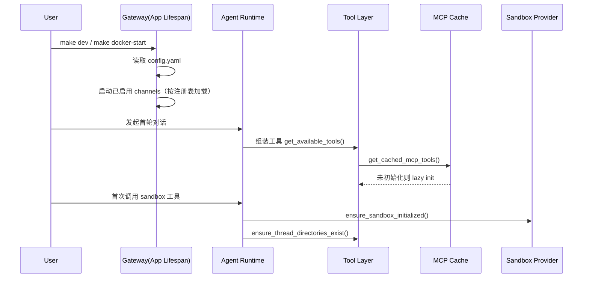

# 项目初始化指南（按需加载）

## 1. 目标

本文档说明 DeerFlow 在本地初始化时，哪些能力在启动阶段完成，哪些能力采用“按需加载（Lazy Init）”在首次使用时再初始化，以降低冷启动开销并减少无效资源占用。

## 2. 基础初始化步骤

> 适用于首次拉起 DeerFlow 开发环境；详细安装说明见 `SETUP.md`。

1. 在项目根目录生成配置：
   ```bash
   make config
   ```
2. 编辑 `config.yaml`，至少配置 1 个可用模型（`models`）。
3. 按需选择启动方式：
    - 本地开发：`make dev`
    - Docker 开发：`make docker-start`

## 3. 按需加载清单

| 组件                              | 启动阶段                   | 按需触发时机                                      | 关键实现                                                                                                                  |
|---------------------------------|------------------------|---------------------------------------------|-----------------------------------------------------------------------------------------------------------------------|
| MCP Tools                       | 不强制预加载                 | 首次组装工具集且存在启用的 MCP Server 时加载；失败降级为空列表       | `packages/harness/deerflow/tools/tools.py`、`packages/harness/deerflow/mcp/cache.py`                                   |
| MCP 缓存失效                        | 启动时记录配置 mtime          | `extensions_config.json` 修改后自动判定过期并重新初始化    | `packages/harness/deerflow/mcp/cache.py`                                                                              |
| 线程目录（workspace/uploads/outputs） | 默认只计算路径                | 首次执行 sandbox 工具时创建目录（仅 local sandbox）       | `packages/harness/deerflow/agents/middlewares/thread_data_middleware.py`、`packages/harness/deerflow/sandbox/tools.py` |
| Sandbox 实例                      | 默认不在 `before_agent` 获取 | 首次工具调用时通过 `ensure_sandbox_initialized()` 获取 | `packages/harness/deerflow/sandbox/middleware.py`、`packages/harness/deerflow/sandbox/tools.py`                        |
| IM Channel 驱动                   | 仅启动已启用渠道               | 启动渠道时按注册表反射加载对应类                            | `app/channels/service.py`                                                                                             |
| DeerFlowClient 内部 Agent         | 构造 client 时不创建 agent   | 首次 `chat()/stream()` 时创建；配置 key 变化时重建       | `packages/harness/deerflow/client.py`                                                                                 |

## 4. 初始化时序（简化）



## 5. 验证清单

1. **MCP lazy init**：首次调用需要 MCP 的能力时，日志应出现 `performing lazy initialization`。
2. **目录懒创建**：local sandbox 下，首次工具调用后出现 `backend/.deer-flow/threads/<thread_id>/user-data/...`。
3. **Sandbox lazy acquire**：无工具调用的纯对话不应触发 sandbox 获取。
4. **Channel 按需加载**：未启用的渠道不应被实例化与启动。

## 6. 排障建议

- MCP 工具未生效：确认 `extensions_config.json` 中对应 server 为 `enabled: true`，并检查依赖是否安装完整。
- 本地工具报路径/目录错误：先确认线程 `thread_id` 已传入，并验证 `thread_data` 是否写入运行态。
- 渠道启动失败：检查 `channels.<name>` 配置与环境变量是否齐全，查看 gateway 日志中的 import/start 异常。

## 7. 相关文档

- `SETUP.md`：环境安装与基础启动
- `CONFIGURATION.md`：配置项说明
- `ARCHITECTURE.md`：系统架构总览
- `MCP_SERVER.md`：MCP 服务接入与配置


